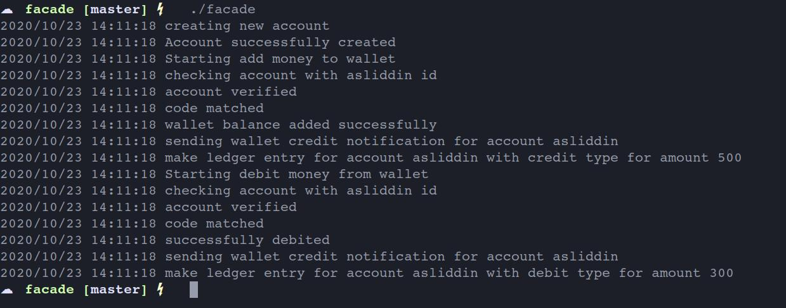
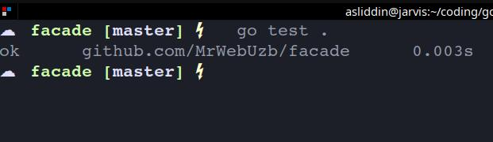

# Wallet Facade example in Golang

__created by Asliddin Abdivasiyev__

### Wallet Facade problem statement

---

### Wallet Facade problem UML diagram

---

### Result of program

---

### Unit testing result
